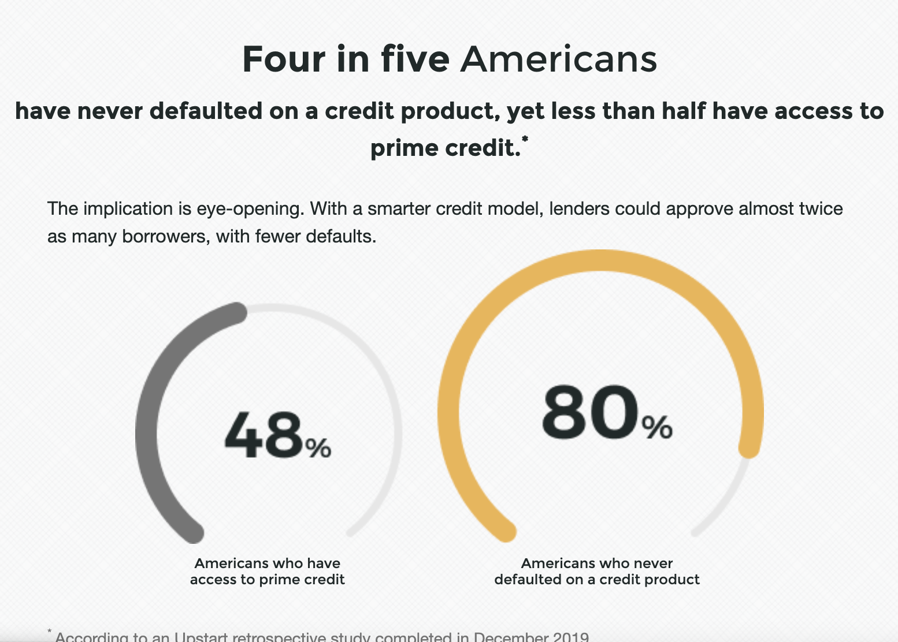
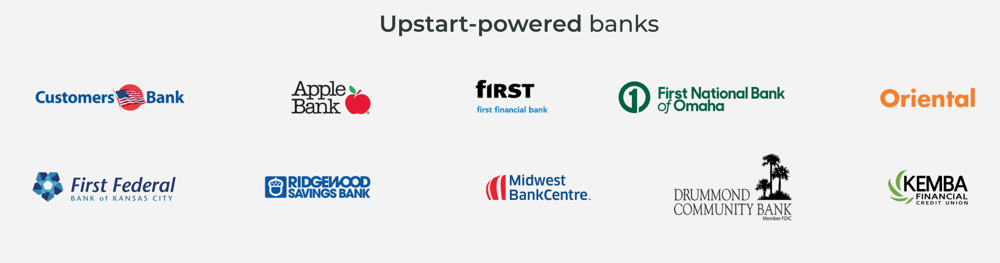
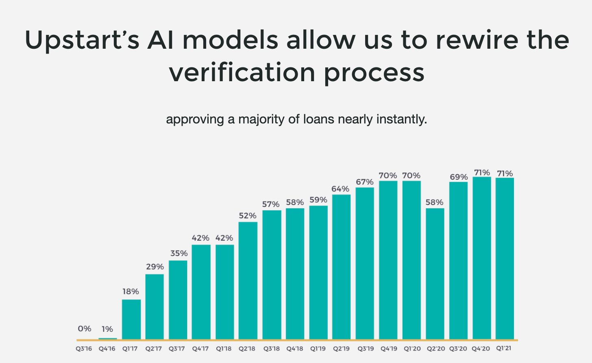
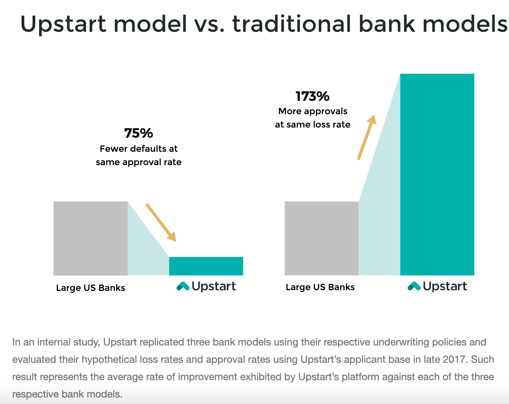
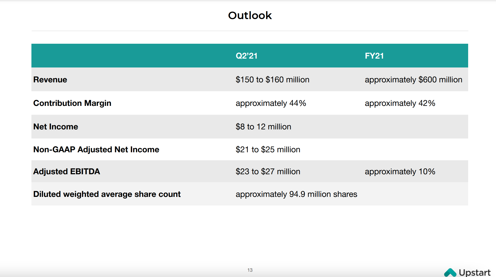
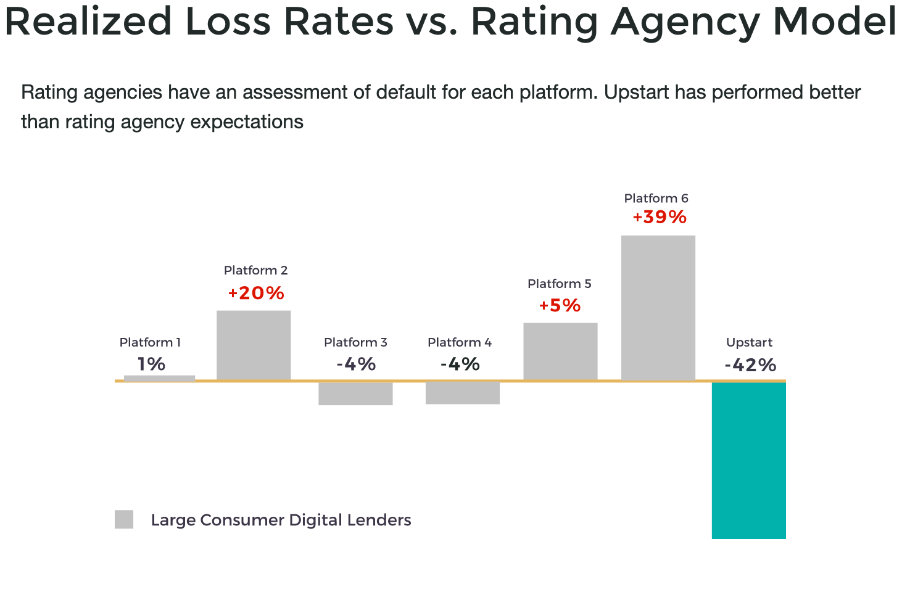
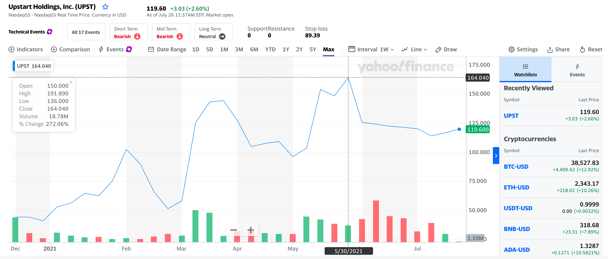

#    And "Lending" For All

     

Here is a common scenario for millennials. John Doe is 22 years old, and is attending an IVY league school. He makes a six figure salary working for a hedge fund company. He applies for a $10,000 loan at a traditional bank. Bank rejects his loan on the basis of "lack of credit history". He tries another bank, and this time gets approved but with an extremely high APR - over 35%. Well, the aforementioned scenario is a true anecdote of a budding entrepreneur named Paul Gu. Along with Dave Girourd and Anna M. Counsel, co-founded a Fintech company called UPSTART Holdings, Inc. If Paul Gu have applied his loan through UPSTART, he would have been approved in seconds with a fixed interest rate between 6.5% and 22%. UPSTART CEO, Dave Girourd, argues: 
*    that there is a "misallocation of capital in our economy". Large companies spend lot of money to recruit and hire college graduates, yet given their lack of traditional credit history, "the graduate themselves couldn't raise $30,000 if their life depended on it" (Ha, 2012).

 
 (Upstart (about), 2021) 
 

 *  Traditional lenders use simple FICO-based models to decide who is approved for credit and at what interest rate. While simple and intuitive, these "scorecard"  methods are limited in their ability to quantify risk (Upstart (about), 2021).
    
Four in five Americans have never defaulted on a credit product, yet less than half have access to prime credit. 

 

UPSTART was incorporated in 2012 - headquartered in San Mateo, California - by Dave girourd, Anna Counselman (an ex-google director and a manager respectively) and Paul Gu. 

*   UPSTART raised $1.75 million seed round of funding from Kliener Perkins Caufield & Byers, NEA, Google Venture, First Round Capital, Crunchfund, and Dallas Maverick's owner Mark Cuban (Ha, 2012). 

*   They subsequently raised a series A round of $5.9 millions which included new investors Eric Schmidt (google executive chairman), Mark Benioff, Khosla Ventures, Founders Fund, and collaboration Fund. In 2015, UPSTART raised a series C round of $35 millions from Third Point Capital. They raised $32.5 millions from Rakuten in 2017. In 2019, UPSTART raised series D round of $50 millions from the Progressive Corporation (Upstart(company), 2021) 

On December 2020, UPSTART holdings issued $12 Million shares at $20.0 per share on NASDAQ with a ticker symbol (UPST). With this IPO, UPSTART was able to raise staggering $252 millions to further finance their products. 

*   Goldman Sachs, BOFA Securities, and Citi Group acted as the underwriters for UPST IPO; and Jefferies, Barclays, JMP Securities, and Blaylock Vom were the co-managers (Upstart Stock Forecast, 2021).

*   Using AI (machine learning algorithms), UPSTART developed an income and default prediction model that is capable of determining the creditworthiness of prospective borrowers.UPSTART loans range from $1,000 to $50,000 concern 3 to 5 years loan terms with APR ranging from 6.5% to ~30% (Upstart(Nasdaq:UPST), 2021).

UPSTART is primarily focused on personal loans; it thus offers help customers with following loans:
     Moving Loans:
     Medical Loans: 
     Home Improvement Loans:
     Credit Card Loans:
     Debt Consolidation Loans:
     Auto Loans: 
     Mortgage-(property) Loans.

*   Above products are offered directly though the UPSTART website emitted by a partner bank - UPSTART itself doesn't provide any loans, with very small exceptions (Upstart(Nasdaq:UPST), 2021). 

These loans can be retained by the originating bank or sold to UPSTART's network of institutional investors or sometimes even funded by UPSTART's own Balance Sheet. 
    
 *   In Q3 2020, around 22% of the loans issued directly through UPSTART were retained by the originating bank. Around 76% were purchased by the institutional investors (such as PIMCO, Goldman Sachs, Morgan Stanley), and about 2% were actually funded by UPSTART's own balance sheet (Upstart(Nasdaq:UPST), 2021).    

UPSTART partners with 10 banks and generates around 98% of its revenue with fees paid by these banks. These charges are the combination of referral fees, platform fees, and loan servicing fees. Upstart partners with the following banks:

 (Upstart (about), 2021)

Larger Tier-1 banks are not yet partnering with UPSTART as they are contemplating whether they should build their own AI powered platform - cost of the whole project is the bottleneck point, or partner with an existing Fintech company. 

*   UPSTART controls ~5% of the personal loan market, and its projected market share to rise by 11.9% a year over 2020 - 2025 period (Upstart(Nasdaq:UPST), 2021). 

UPSTART has recently started applying its AI methodology to major markets like Auto, Home, and Credit Cards. UPSTART originated 10.8 Billion loans and 71% of these loans were fully automated. 

 (Upstart (about), 2021)

 (Upstart (about), 2021)

UPSTART facilitates 27% more loan approvals compared to traditional large banks. At this approval rate, UPSTART gets 75% less defaults than the larger US Banks. 

 (Upstart (about), 2021)

    
Since UPSTART is basically an AI (machine learning) driven Financial Company, it leverages big stack of cutting edge technologies for its ambitious business model. For their multifaceted DevOPs, CI/CD, and RegTech operations, UPSTART uses following technologies: 
Python, Java Scripts, Groovy, SQL, Bash, Kubernets, ECS, Jenkins, Looker, Tableau, Amazon AWS, Google Cloud (Big Query, SnowFlake, RedShift), Spark, Kafka, Airflow, Appache-Flink, Apache-Pinot, Apache-Hbase, Apache-Cassandra, AVRO, Postgres, Ansible, Docker, NoSQL, Hodoop, Terraform, Lambda, Casanova, and MongoDB.

 (Upstart (about), 2021)

Upstart operates a cloud based AI Lending platform. Some of the UPSTART key competitors are SOFI, Lending Club, Float, Lending Home, Earnest, Loan Depot, Lexin Fintech, AMTD International, Blucora, and oportun Financial. In Q1 2021, UPSART revenue grew 90% Y/Y to $121.3 millions with net income of $10.1 millions up 620% from previous year. Contribution profit went up 117% to $55.8 millions. Operation expenses reached $105.8 millions up 66% from previous year. Following are the current UPSTART holdings, inc. financial statements (Upstart(about), 2021)

 (Upstart (about), 2021)

 (Upstart (about), 2021)

 (Upstart (about), 2021)

 (Upstart (about), 2021)

Here is the forecast outlook for fiscal year 2021.

 (Upstart (about), 2021)

*   Although pandemic has affected UPSTART'S business, but they have fared much better than their competitors. Unfortunately, inevitable rise in the interest rate will negatively influence UPSTART's growth as borrowing would become more expensive for consumers (Upstart(Nasdaq:UPST), 2021). 

Upstart leverages and carefully tracks core business metrics like Transaction Volume to Loan Conversion Rate, and Transaction Volume to Dollar amounts. Here are some of the core metrics UPSTART uses:

 (Upstart (about), 2021)

 (Upstart (about), 2021)

*   Stock market analysts project UPSTART (UPST) earnings of $0.64 per share and revenue of $602.85, which would represent changes of plus 178.26% and plus 158.27% respectively from prior year. UPSTART has a forward P/E ratio of 183.8 right now. This represents a premium compared to its industry's average forward P/E of 30.3 (Upstart Holdings, Inc.(yahoo), 2021).

As of July 6, 2021. 11:37 AM, UPST stock is selling at 119.6000. Here is a historical (max) chart of UPST's stock performance:

 (Upstart Holdings, Inc.(yahoo), 2021)

*   With December 2020 IPO, UPSTART's lockup period expired on early June 2021. Shares of the company owned by company insiders and major shareholders became eligible to be traded as a result of the expiration of the lockup period (Upstart Stock Forecast, 2021)

UPST did experience some sell-off to its stock because of the aforementioned expired initial lockup period. 

*   Given its total addressable market (management and financial performance), UPSTART is reasonably valued at 15 to 17 times its sales (Upstart(Nasdaq:UPST), 2021).

Market and customer concentration are two major issues confronting UPSTART Holdings, Inc. Most of UPSTART's growth and marketing initiatives are focused on bringing potential borrowers to UPSTART website. It relies on direct mail, podcast advertising, affiliate marketing, and online advertising to boost its growth. Noteworthy is their dependence on Credit Karma. 
*   In 2020, 52% of consumers that applied for loan on upstart.com learned about and access upstart.com through website of a loan aggregator, Credit Karma. In 2020, Cross River Banks generated 65% - down from 81% in 2019, UPSTART's total revenue, and 15% of sales were generated by second largest customer bank. Hence, about 80% of UPSTART's revenue was generated by 2 banks (Upstart(Nasdaq:UPST), 2021). 

I would recommend UPSTART management to reduce its reliance on borrower's traffic from Credit Karma, and diversify their customer concentration risk to multiple banks. UPSTART could achieve the above goals by partnering with a Tier-1 bank. That would solve both their marketing and customer concentration problems. With Tier-1 bank on board, UPSTART could integrate and leverage its business agenda with an established Financial player; especially with emergence of their Auto line business unit. They could also benefit from bundling multiple products through cross sales opportunities. 

In conclusion, UPSTART is a fast growing digital lending player. They use AI machine learning to predict borrower's creditworthiness. 

*   It uses 1,600 data points to score borrowers (Upstart(Nasdaq:UPST), 2021).

Unlike traditional larger banks, which heavily rely on credit history and FICO scores, UPSTART is leveraging the forgotten market of borrowers which previously didn't have access to prime credit. As proven by the astounding success of UPSTART, this aforementioned market has a very low default rate compared to the total market. UPSTART revenue has experienced perpetual up-tick as their AI algorithmic data is learning and optimizing constantly. UPSTART had solved its liquidity issue by going public, and was able to raise $252 million to further finance its products. UPSTART issued its UPST stock at 20.00 per share and was topped at $164.04 earlier this year. After UPSTART's lockup period expired, as expected, it did experience some sell-off. Although, since then UPST stock has bounced back nicely, and currently has been selling for ~120.0 per share. Wall Street experts have a buy on UPST stock with some trepidation due to expected related industry level down forecast. UPSTART depends heavily on Credit Karma for their potential borrower's traffic, and it does have a customer concentration problem by having most of its business generated by two banks. They could benefit from diversifying potential borrower's traffic from multiple sources, and could also benefit by partnering with a tier-1 bank.

##   References

Ha, Anthony. (2012, August 8). Former Google Executive Dave Girouard Launches Crowdfunding Service Upstart, Raises $1.75M - Techcrunch. Retrieved from 
https://techcrunch.com/2012/08/08/former-google-executive-dave-girouard-launches-crowdfunding-service-upstart-raises-1-75m/

Upstart(Nasdaq:UPST). (2021, March 22). Benchmark. Retrieved from
https://getbenchmark.substack.com/p/upstart-ai-driven-lending

Upstart Stock Forecast, Price, & News. (2021, July 29). MarketBeat retrieved from
https://www.marketbeat.com/stocks/NASDAQ/UPST/

Upstart(company). (2021, July 19). in Wikipedia.
https://en.wikipedia.org/wiki/Upstart_(company)

Upstart Holdings, Inc. (UPST) Outpaces Stock Market Gaines: What you should know. (2021, July 21). Yahoo Finance retrieved from
https://finance.yahoo.com/news/upstart-holdings-inc-upst-outpaces-214509428.html

Upstart (about). (2021). Upstart Holdings, Inc. retrieved July 26, 2021. from
https://www.upstart.com/about#

